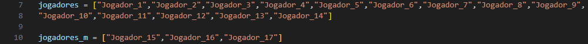

# **Sorteio de Times - Racha do Barreirão**

Este projeto permite realizar o sorteio de exatamente 17 jogadores para formar times automaticamente. Ele utiliza a biblioteca PyQt5 para criar a interface gráfica e a biblioteca `random` para selecionar jogadores aleatoriamente. O programa é útil para dividir jogadores em equipes para atividades esportivas ou outros jogos em grupo.

## Como utilizar/rodar o projeto

Para rodar o projeto, é necessário ter o [Python](https://www.python.org/downloads/) instalado, além da biblioteca PyQt5. Caso ainda não tenha a biblioteca instalada, execute o seguinte comando para instalá-la:

```bash
pip install pyqt5
```

Clone esse repositório.
```bash
git clone https://github.com/SavioSayke/Team_Draw.git
```

Após clonar o repositório, navegue até o diretório dos arquivos pelo seu terminal. Abra seu terminal dentro do diretório do projeto:
    * Para abrir o terminal, navegue até o diretório onde o projeto foi salvo, agora: **segure Shift + botão direito do mouse**. Selecione "Abrir o terminal" ou abra o terminal de sua preferência.

Execute o script utilizando:
```bash
python Team_Draw.py
```
---

## Funcionalidades

- Divisão de jogadores em três times, com a possibilidade de definir a quantidade de jogadores em cada time.
- Seleção de jogadores para o time e para a reserva (fora).
- Interface gráfica interativa, onde os jogadores são sorteados ao clicar nos botões.

## Tecnologias Utilizadas

- Python 3
- PyQt5 (para a interface gráfica)
- random (para sorteio de jogadores)

---

## Como Usar

* A interface será exibida com botões para sortear jogadores para cada time. Basta clicar em cada botão para sortear jogadores para os times correspondentes.

* O programa exibirá os nomes dos jogadores sorteados em diferentes campos de texto para indicar em qual time eles foram alocados.

* Para realizar um sorteio aleatório completo, clique no botão "Sortear Todos" com a logo do programa para dividir todos os jogadores entre os três times e os jogadores fora.

---

## Estrutura do Código

O código possui duas listas principais de jogadores:

**jogadores**: Lista de jogadores principais que serão sorteados para os times.

**jogadores_m**: Lista de jogadores adicionais que também serão sorteados, mas em menor número.

As funções de sorteio (**sorteio_time1_j1, sorteio_time1_j2, etc.**) são responsáveis por realizar a seleção aleatória de jogadores e atualizam a interface com os nomes dos jogadores sorteados.

Ao preencher todos os campos com os nomes dos jogadores, caso você clique em algum botão, o programa irá encerrar automaticamente.

Caso queira alterar a lista de jogadores, basta alterar as duas listas dentro do arquivo Team_Draw.py:

* **jogadores**

* **jogadores_m**

